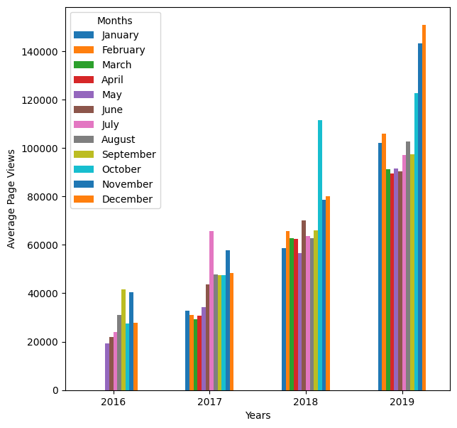

# Visualisation of the forum views trend

## Overview
This project visualizes page view data from the freeCodeCamp forum over time. The dataset consists of daily page views recorded over several years. The objective is to clean, analyze, and generate visualizations to uncover trends, seasonality, and anomalies in the data.

## Dataset
The dataset, `fcc-forum-pageviews.csv`, contains daily page views for the freeCodeCamp forum from May 2016 to December 2019. The columns include:
- `date`: The date of the recorded page views
- `value`: The number of page views on that day

## Visualiыations
This project includes three types of visualizations to explore the data in different ways.

1. **Line Plot (Daily Page Views)**  
   A line plot shows the daily page views over time. The x-axis represents the dates, while the y-axis represents the number of page views. This way we can easily see the progression of how the views grew. Over 3.5 years views increased 9 fold. Big spikes in views were seein in September-October 2016 and October 2018.
   
   

3. **Bar Plot (Monthly Average Page Views)**  
   A bar plot shows the average page views per month for each year. Each bar represents the average page views for a specific month over the years. 
   
   - The growth thrend is very apparent as well looking at the data like this.
   - When comparing the monthly trends year by year the lowest periods shift more to the spring or autumn but summer seems to be the lowest period overall.
   - From 2018 there's a trend for end of the year months to be the highest in views.
    
   

5. **Box Plot (Yearly & Monthly Distribution)**
   
   Two box plots are provided:
   - **Year-wise box plot**  Shows a clear upward trend in the view counts from 2016 to 2019. The median view count increased from around 27,000 median in 2016 to over 140,000 in 2019. The interquartile range (difference between the 25th and 75th percentiles) also expanded, indicating greater variability in the view counts over time.
     
   - **Month-wise box plot** shows the distribution of page views for each month, ordered chronologically. View counts are consistently lower in the middle of each year (from June to September) compared to the earlier months, which agrees to the averaged out bar graph. October seems to have the highest variability in views. December has the lowest median views, after December the views pick up and become the most consistently high in February. 
     
   
